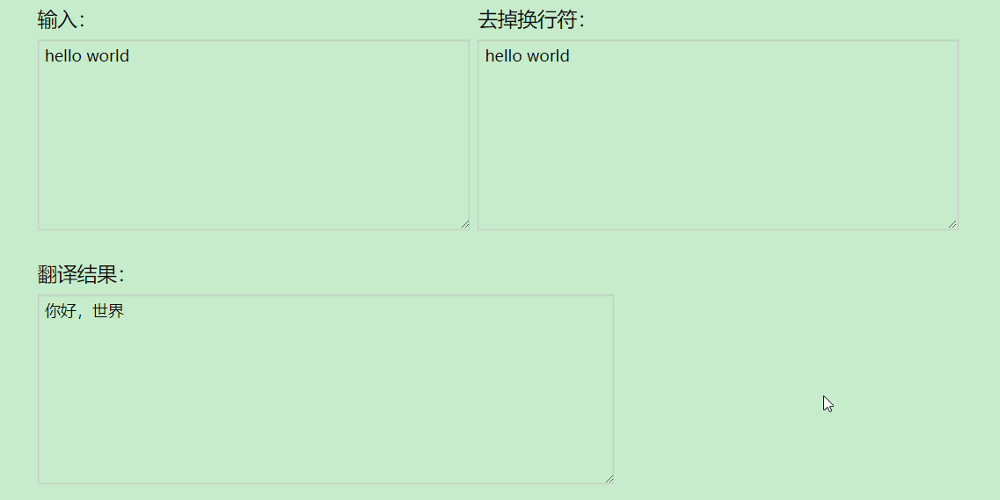

# NewIP
阅读、写作、自媒体工具
持续更新中...

## 说明

text2picture.py  将文本装换为字云

web 目录下为google 翻译工具

复制粘贴英文文本时，换行符导致翻译不准确。工具去掉换行符，并自动调用google 翻译api进行翻译。

## 感谢

* 截图工具 [ScreenToGif](https://github.com/NickeManarin/ScreenToGif)

